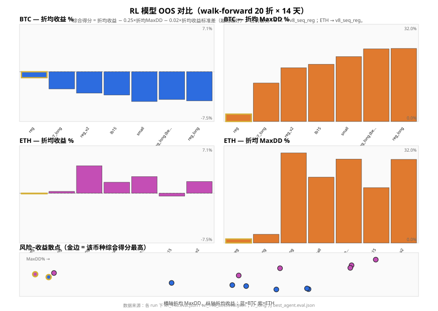

# smart-trader

面向中心化交易所（CEX）的交易与回测工程：规则策略、混合 sleeve 与 **强化学习（实验）** 等。实现与使用说明见 **[python/README.md](python/README.md)**。

## RL 模型样本外对比（Walk-forward 20 折 × 14 天）

下图由本地 checkpoint 的 `wf_14d.eval.json` / `wf_14d_best.eval.json`（及 `v7_long` 的 `best_agent.eval.json`）汇总生成。更新图表：

```bash
cd python && uv run python scripts/render_model_comparison_charts.py
```

脚本会同时写入 `python/checkpoints/reports/`（若目录存在且未被清理）与 **`docs/assets/`**（供仓库首页展示）。


